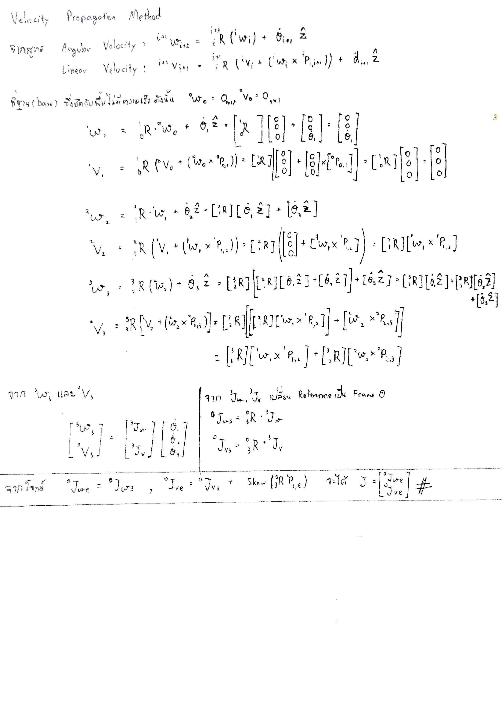

# FRA333 Kinematic Homework #3
Author:
1. Kantapat Laohaphan ID: 65340500001
2. Chawit Supcharoen ID: 65340500015

## Too long; Didn't read!
This repository hosts FRA333 Homework#3 answer. Three important files in this repository are:

1. **FRA333_HW3_6501_6515.py** is the answer compute by using velocity propagation method.
2. **testScript.py** is a script used to verify the answer with the help of roboticstoolbox-python package.
3. **HW3_utils.py** is provided by instructor to compute transformation matrix.

### How to run the code?
```
pip install roboticstoolbox-python numpy==1.24 sympy
python testScript.py 
```


## Repository Description
รายงานนี้เป็นส่วนหนึ่งของวิชา Kinematic ในการศึกษา วิธีค่าของ Jacobian Matrix, การเช็คว่าเกิด Singularity ซี่งส่งผลให้ระบบสูญเสียการควบคุมไปอย่างน้อย 1 Dof หรือไม่ เเละการหาค่าแรงบิดที่เกิดขึ้นในแต่ละข้อต่อ


## Math and Theory
Two methods are used to calculate jacobian.
1. Partial differential method
2. Velocity propagation method

Partial differential method integrated in roboticstoolbox-python package was used for code testing. Velocity propergation method will be used for main calculation.

### Velocity propagation method
This method relied on formular that calculate angular and linear velocity of each frame then keep propagate until end-effector's frame has reached.

> <sup>i+1</sup>ω<sub>i+1</sub> = <sup>i+1</sup>R<sub>i</sub> ( <sup>i</sup>ω<sub>i</sub> ) + θ'<sub>i+1</sub>z &nbsp;&nbsp;&nbsp;&nbsp;&nbsp;&nbsp;&nbsp;&nbsp;&nbsp;&nbsp;&nbsp;&nbsp;&nbsp;&nbsp;&nbsp;&nbsp;&nbsp;&nbsp;&nbsp;&nbsp;&nbsp;&nbsp;&nbsp;*when θ'z is revolute joint's angular speed*\
> <sup>i+1</sup>v<sub>i+1</sub> = <sup>i+1</sup>R<sub>i</sub> ( <sup>i</sup>v<sub>i</sub> + <sup>i</sup>ω<sub>i</sub> x <sup>i</sup>p<sub>i,i+1</sub>) + d'<sub>i+1</sub>z &nbsp;&nbsp;&nbsp;&nbsp;&nbsp;*when d'z is prismatic joint's speed*



### Check for singularity
To check for singularity, split the jacobian into jacobian for linear velocity and jacobian for angular velocity (Each should be 3x3 matrix). Find determinant of both jacobian, if any is near zero (<0.001), function return as true. Otherwise, return false.

```
def checkSingularityHW3(q:list[float])->bool:

    Jacobian = endEffectorJacobianHW3(q)

    # Extract jacobian in angular velocity and linear velocity
    j_v = np.array(Jacobian[1])
    
    if abs(np.linalg.det(j_v)) < 0.001:
        print("Singularity in linear movement.")
        return True
    
    return False
```

### Compute for effort
Effort can be compute from ***"Force-velocity relationship"*** formula.

> τ<sub>f</sub> = J<sub>v</sub><sup>t</sup> x Force\
> τ<sub>m</sub> = J<sub>ω</sub><sup>t</sup> x Moment\
> Στ = τ<sub>f</sub> +  τ<sub>m</sub>

```
    # Since input force is reference on frame e, but jacobian is on frame 0.
    # Transform input using R_0_e

    input_moment_0 = np.dot(R_0_e, input_moment_e)
    input_force_0 = np.dot(R_0_e, input_force_e)

    # Compute joint torque for moment at end effector
    tau_T = np.dot(j_w.transpose(), input_moment_0)

    # Compute joint torque for force at end effector
    tau_F = np.dot(j_v.transpose(), input_force_0)

    # Combine joint torque used for force and moment at end effector
    return tau_F + tau_T
```

## Testing method
### First create MDH parameters
```
robot = rtb.DHRobot(
    [
        rtb.RevoluteMDH(a = 0, alpha = 0, d = d_1, offset = pi),
        rtb.RevoluteMDH(a = 0, alpha = pi/2, d = 0, offset = 0),
        rtb.RevoluteMDH(a = a_2, alpha = 0, d = 0, offset = 0)
    ], name="HW3rob")

#create joint3 to end-effect
translate_to_end = SE3(a_3 -(d_6),-(d_5),d_4) @ SE3.RPY(0.0,-pi/2,0.0)
#add end-effect to robot
robot.tool = translate_to_end
```
### Proof1 that need to find Jacobian on frame 0
use funtion jacob0(q)

`J = robot.jacob0(q)` to create Jacobian on frame 0

```
J_linear = J[:3]
J_angular = J[3:]
print(J_angular)
print(J_linear)
```
For show jacobian matrix

### Proof2 to show singularity
```
J = robot.jacob0(q) 
J_reduce = J[:3,:] #:3 เอาเเถวบนถึงเเถวที่ 3 , : เท่าหลักทุกตัว
J_det = np.linalg.det(J_reduce)  #เช็คค่าsingular ต่อไปคือถ้าค่าใกล้ 0 จะถือว่า det เป็น 0 ก็คือการเป็น singularity
if abs(J_det) < 0.001: #เนื่องจาก det ได้ค่าออกเเค่ตัวเดียว norm คือการรวมค่ามาเป้น vector เดียว เลยต้องใช้เป้น abs เเทน
    kebka_sing = True
else:
    kebka_sing = False
```
if kebka_sing == True => is singularity
if kebka_sing == False => is not singularity

### Proof3 to show Torque values
```
J = robot.jacob0(q) 
w = np.array(w) #change to nx1 matrix
#find taq
taq = robot.pay(w,q,J,0)
ref_taq = Rob.computeEffortHW3(q,w)
```
find taq by using funtion .pay of robotic tool box that require Wench ,Q ,Jacobian and Frame values


## Python package requirement 
1. Numpy version 1.24.4
2. Sympy version 1.13.3
3. roboticstoolbox-python 1.1.1 

***Note*** : This roboticstoolbox-python version doesn't support numpy 2.0 and above yet. If you've numpy version is newer than 1.24.4, consider installing numpy version 1.24.4 on seperated python virtual environment. [Guide](https://docs.python.org/3/library/venv.html)

### Install package using pip
```
python -m pip install numpy==1.24 sympy roboticstoolbox-python
```


## How to use?

`python FRA333_HW3_6501_6515.py`
hold the answer in python function form.
And use `python testScript.py`
to compare answer with another method.
Output from `FRA333_HW3_6501_6515.py` is included in `testScript.py`

### Runs script
```
python testScript.py
```


## Reference

